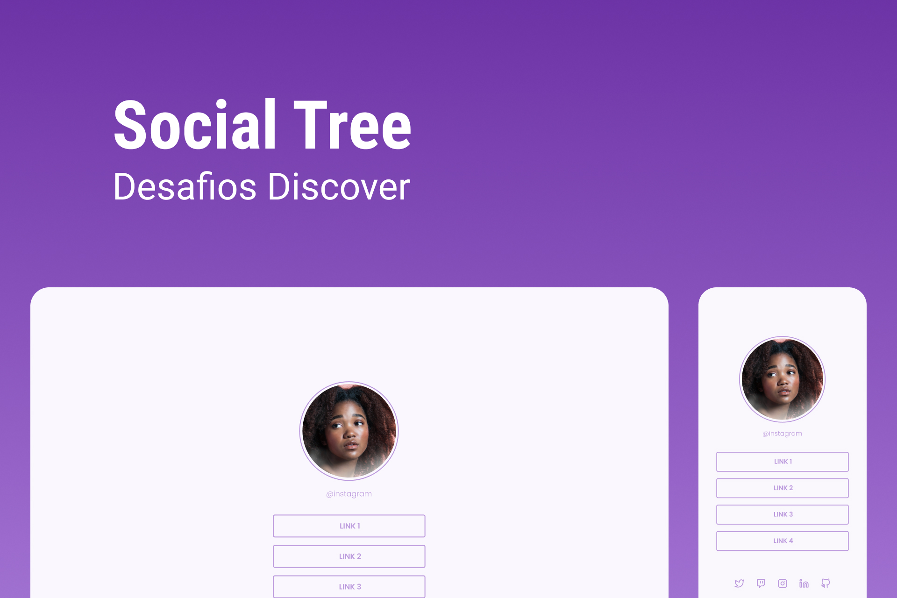

<h1 align="center"> Desafio Social Tree </h1>

  <b>PT-BR:</b> A atividade sugerida neste desafio foi uma tela com imagem de perfil, lista de links e botões para redes sociais. 

  <b>EN:</b> The activity suggested in this challenge was a screen with a profile image, a list of links and buttons for social networks.
 

  <a href="#gear-tecnologias">Tecnologias</a>&nbsp;&nbsp;&nbsp;|&nbsp;&nbsp;&nbsp;
  <a href="#writing_hand-aprendizados">Aprendizados</a>&nbsp;&nbsp;&nbsp;|&nbsp;&nbsp;&nbsp;
  <a href="#memo-licença">Licença</a>

  

  

## :gear: Tecnologias

- Figma
- HTML
- CSS

## :writing_hand: Aprendizados

Esse foi o primeiro projeto que usei o Figma para ver tamanhos e cores, não tive muitas dificuldades em usar e foi uma experiência positiva com a ferramenta. Em questão de HTML e CSS utilizei o que aprendi nos projetos anteriores e testei novas propriedades.

## :memo: Licença

Esse projeto está sob a licença MIT.
